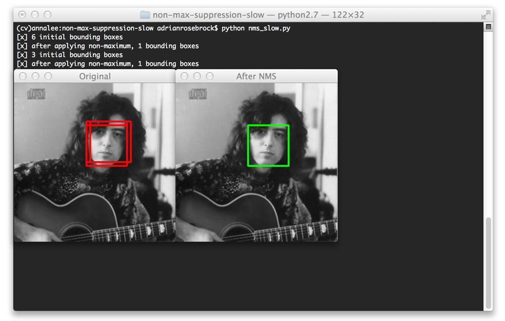

<h3> Object Detection </h3>

<b>1. Using an Image Classifier(pretrained) to detect objects using keras and openCV </b>

Here we take a Convolutional Neural Network trained for image classification (pre-trained RESNET-50) and utilize `image pyramids`, `sliding windows`, and `non-maxima suppression` to build a basic object detector.Basically we combine traditional computer vision object detection algorithms with deep learning.

<b> In Image Classification :</b> Input : Image --> Output : Class Label   We present the input image to our neural network, and we obtain a single class label and a probability associated with the class label prediction.This class label characterizes the contents ( the most dominant and  visible contents) of the image. 

<b> Object Detection :</b> Along with outputting the class labels i.e the objects present in the image, it also outputs where in the image the objects are with multiple bounding box coordinates. 

More specifically, it outputs 3 values,including :  
1. A list of bounding boxes, or the (x, y)-coordinates for each object in an image
2. The class label associated with each of the bounding boxes
3. The probability/confidence score associated with each bounding box and class label

<b> How deep learning image classifier can be converted into an object detector? </b>
We utilise the elements of traditional computer vision algorithms to convert our CNN image classifier into an object detector. 

The first element we use is <b>`Image Pyramids`</b>:  

* An “image pyramid” is a multi-scale representation of an image:

At the bottom of the pyramid, we have the original sized image .
At each subsequent layer, the image is resized and optionally smoothed.
The image is progressively subsampled until some stopping criterion is met( when a minimum size has been reached), and no further subsampling is required.

The second element we use is <b>`Sliding Windows`</b>:  

* A sliding window is a fixed-size rectangle that slides from left-to-right and top-to-bottom within an image:

At each stop of the window we would:
1. Extract the Image within the sliding window
2. Input Image to an Image Classifier
3. obtain predictions(class label and probability scores)

Image pyramids and sliding windows helps us localize objects at different locations and multiple scales of the input image

The Third element we use is <b>`Non-Maxima Suppression`</b>:  

The object detectors generally outputs multiple, overlapping bounding boxes surrounding an object in an image. 
This happens because as the sliding window approaches an image, the classifier outputs larger and larger probabilities of  the object class(i.e higher probability of object being detected) . 

Since there’s only one object of a particular class,multiple bounding boxes can create a problem. 
The solution is to apply non-maxima suppression (NMS), which removes weak, overlapping bounding boxes by giving us the ones with higher confidence.

<h3> 1.3 The steps we follow in the Object Detection Algorithm:</h3>

1. We input image.
2. We construct image pyramid fot the input image.
3. For each scale of the image pyramid, we run a sliding window:
     3.1. For each stop of the sliding window,we extract the image inside the sliding window(ROI)
     3.2. We take the sampled image and pass it through our CNN originally trained for image classification
     3.3. Examine the probability of the top class label of the CNN, and if meets a minimum confidence,we record 
            3.3.1. class label and
            3.3.2  location of the sliding window
4. We apply non-maxima suppression to the bounding boxes for different classes.
5. We return the results of the detected objects(bounding box, class label and probability)

